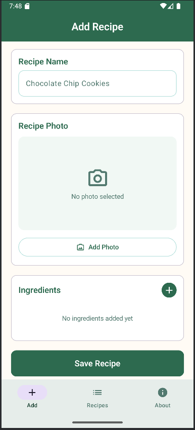
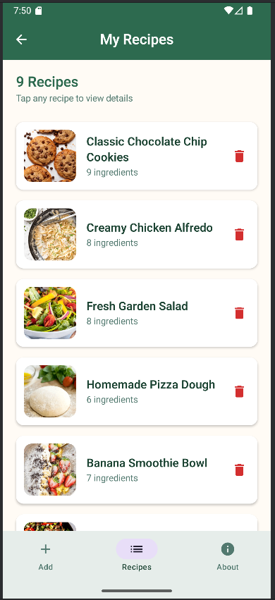
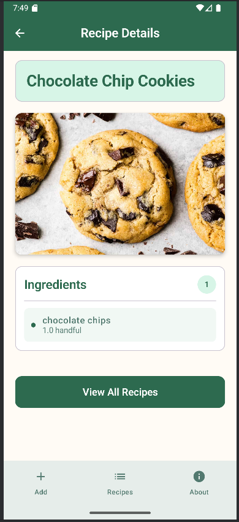
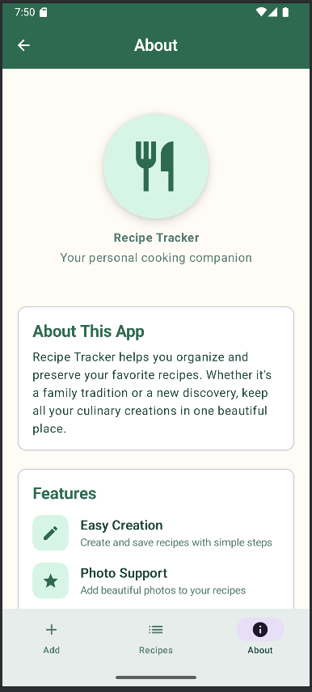

# Recipe Tracker

A beautiful Android application for organizing and managing your favorite recipes, built with Jetpack Compose and Material 3 design.

## Overview

Recipe Tracker is a multi-screen mobile application that allows users to create, store, and browse their personal recipe collection. The app features a modern, intuitive interface with photo support, ingredient management, and seamless navigation between different sections.

## Features

### Core Functionality
- **Recipe Creation**: Add new recipes with names, photos, and detailed ingredient lists
- **Photo Integration**: Select images from device gallery with automatic cropping and preview
- **Ingredient Management**: Add ingredients with optional amounts and units through a modal dialog
- **Recipe Browsing**: View all saved recipes in an organized list with thumbnails
- **Recipe Details**: Comprehensive view of individual recipes with ingredients and photos
- **Data Persistence**: Recipes are maintained in memory during app session

### User Experience
- **Material 3 Design**: Modern, cohesive design system with beautiful green color palette
- **Responsive Navigation**: Bottom navigation bar with top app bar and back button support
- **Form Validation**: Real-time error checking with animated error messages
- **Empty States**: Helpful messaging and call-to-action buttons when no content exists
- **Scrollable Content**: Proper handling of long content lists and ingredient collections

### Technical Features
- **Jetpack Compose UI**: Modern declarative UI framework
- **Component Architecture**: Well-organized, reusable components separated by screen
- **State Management**: Shared ViewModel with CompositionLocal providers
- **Image Loading**: Coil integration for efficient image handling
- **Type Safety**: Comprehensive Kotlin type safety throughout

## Screenshots

The app includes four main screens:
- **Add Recipe**: Create new recipes with photo and ingredient management
  

- **Recipe List**: Browse all saved recipes with search and delete functionality
  

- **Recipe Detail**: View complete recipe information with formatted ingredients
  

- **About**: App information and feature overview
  


## Architecture

### Project Structure
```
app/src/main/java/com/example/assignment_3/
├── data/
│   └── MockData.kt                # Sample recipe data
├── layouts/
│   ├── MainLayout.kt              # Shared screen layout
│   ├── SharedBottomBar.kt         # Bottom navigation
│   └── SharedTopBar.kt            # Top app bar
├── models/
│   ├── Ingredient.kt              # Ingredient data model
│   └── Recipe.kt                  # Recipe data model
├── navigation/
│   ├── Router.kt                  # Navigation setup
│   └── Routes.kt                  # Route definitions
├── screens/
│   ├── addrecipe/                 # Add recipe screen components
│   ├── recipelist/                # Recipe list screen components
│   ├── recipedetail/              # Recipe detail screen components
│   └── about/                     # About screen components
├── ui/theme/
│   ├── Color.kt                   # App color palette
│   ├── Theme.kt                   # Material 3 theme setup
│   └── Type.kt                    # Typography definitions
└── viewmodels/
    └── RecipeViewModel.kt         # Shared state management
```

### Key Design Patterns
- **MVVM Architecture**: Clear separation between UI and business logic
- **Component Composition**: Reusable UI components with single responsibilities
- **Declarative UI**: Jetpack Compose for reactive user interfaces
- **Shared State**: CompositionLocal for dependency injection
- **Material Design**: Consistent theming and component usage

## Setup and Installation

### Running the App
1. Clone the repository
2. Open the project in Android Studio
3. Sync the project to download dependencies
4. Run the app on an emulator or physical device

## Known Issues and Limitations

### Current Limitations
- **Data Persistence**: Recipes are stored in memory only and are lost when the app is closed
- **Image Storage**: Selected photos are referenced by URI, may not persist across device restarts
- **Network Dependency**: No offline image caching for selected photos
- **Search Functionality**: No search or filtering capabilities in recipe list
- **Recipe Editing**: No ability to edit existing recipes after creation

### Future Enhancements
- Local database integration (Room) for persistent storage
- Recipe editing and updating capabilities
- Search and filter functionality for recipe browsing
- Recipe categories and tagging system
- Export/import recipes to external storage
- Recipe sharing capabilities
- Cooking timers and step-by-step instructions

## Development Notes

### Design Decisions
- **Color Palette**: Green-based theme chosen for food/cooking association
- **Navigation Pattern**: Bottom navigation for primary sections, top back button for hierarchy
- **Modal Dialogs**: Used for ingredient addition to maintain clean main screen layout
- **Error Handling**: Animated snackbars provide non-intrusive user feedback

## AI 
### Assistance (Claude) was used for:
- Code documentation
- README creation
- Learning about Jetpack Compose concepts, state management patterns, navigation and Material Design 3 components
- Understanding best practices for Android development

## Work Breakdown Structure (WBS), LOEs and Actuals

### Task 1: Project Planning | 1.5 hours
* 1.1: Work Breakdown Structure
* 1.2: LOE estimates
* 1.3: Gantt chart creation

### Task 2: Git Repository & Machine Setup | 0.75 hours
* 2.1: GitHub repository
* 2.2: Git configuration on workspaces
* 2.3: Initial project commit
* 2.4: Screenshot 1 - GitHub page with Assignment 3 project
* 2.5: Screenshot 2 - Main computer with Android Studio & Git Branches popup
* 2.6: Screenshot 3 - Revision history files

### Task 3: Project Foundation | 0.5 hours
* 3.1: Android Empty Activity project
* 3.2: Project structure organization
* 3.3: Dependencies configuration (navigation)

### Task 4: Navigation System | 1 hour
* 4.1: Sealed class routes
* 4.2: Navigation controller
* 4.3: Shared layout with navigation bar
* 4.4: Screen routing logic

### Task 5: Screen 1 - Input Screen | 3 hours
* 5.1: Input form UI design
* 5.2: Text field handling
* 5.3: Image link input
* 5.4: Data validation logic
* 5.5: State management setup

### Task 6: Screen 2 - Detail View | 2 hours
* 6.1: Detail screen layout
* 6.2: Parameter passing implementation
* 6.3: Data display components
* 6.4: Navigation integration

### Task 7: Screen 3 - List View | 2 hours
* 7.1: List display UI
* 7.2: Provider setup for state sharing
* 7.3: Delete functionality
* 7.4: Navigation to detail view
* 7.5: Empty state handling

### Task 8: Screen 4 - Information Screen | 1.5 hours
* 8.1: Visual design
* 8.2: Content creation
* 8.3: Styling and polish

### Task 9: State Management & Rotation | 0.5 hours
* 9.1: Stateful/stateless composable separation
* 9.2: Device rotation handling
* 9.3: State persistence verification

### Task 10: Documentation & Testing | 1.5 hours
* 10.1: Internal code documentation
* 10.2: README file creation
* 10.3: Comprehensive functionality testing
* 10.4: LOE actuals tracking and analysis

### Task 11: Final Submission | 0.25 hours
* 11.1: Final code cleanup
* 11.2: Project zip file


## Level of Effort Summary

| Task # | Task Name | Estimates (hrs) | Actuals (hrs) | Notes |
|--------|-----------|----------------|---------------|--------|
| 1 | Project Planning | 1.5 | 1.5 | Estimate was accurate |
| 2 | Git Repository & Machine Setup | 0.75 | 0.75 | Estimate was accurate |
| 3 | Project Foundation | 0.5 | 0.5 | Estimate was accurate |
| 4 | Navigation System | 1 | 1 | Estimate was accurate |
| 5 | Screen 1 - Input Screen | 3 | 3 | Estimate was accurate |
| 6 | Screen 2 - Detail View | 2 | 3 | Spent additional time experimenting with proper layouting and styling |
| 7 | Screen 3 - List View | 2 | 2 | Estimate was accurate |
| 8 | Screen 4 - Information Screen | 1.5 | 2 | Spent additional time experimenting with proper layouting and styling |
| 9 | State Management & Rotation | 0.5 | 0.5 | Estimate was accurate |
| 10 | Documentation & Testing | 1.5 | 1.5 | Estimate was accurate |
| 11 | Final Submission | 0.25 | 0.25 | Estimate was accurate |
| **TOTALS** | | **14.5** | **16.0** | **+1.5 hour variance** |
